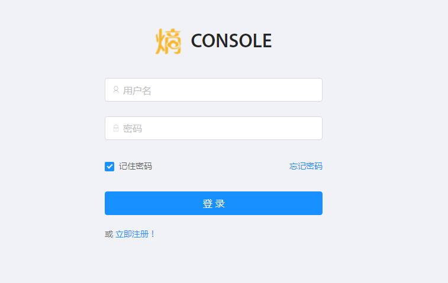
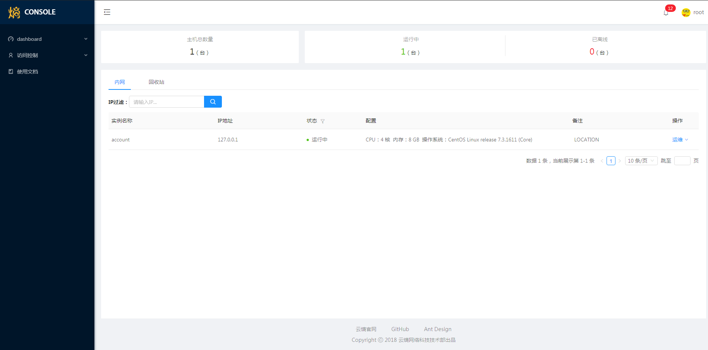
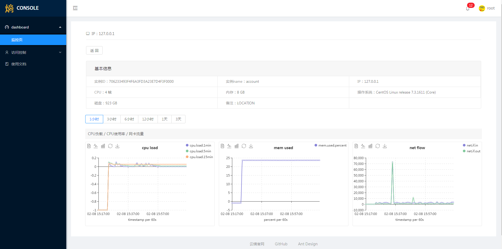

# dashboard

## 介绍

> dashboard是控制台开源的前端实现，目前包含以下组件：

 
* 用户管理，包括用户登录、登出、创建用户、重置密码等
* 主机监控，包括主机状态、基本信息、CPU负载、CPU使用率、网卡流量监控等

## 安装

> 直接clone git仓库

    $ git clone https://github.com/cloudtropy/dashboard.git
    $ cd dashboard

## 本地开发

> 安装依赖 （如果网络状态不佳，可以使用cnpm进行加速）

    $ npm install

> 启动项目

    $ npm start

> 启动完成后会自动打开浏览器访问 http://localhost:8080，看到登录页面就代表成功了

> 登录页 （后台服务部署好之后，账户名密码默认都是root）



> dashboard



> 监控详情页



## 目录结构

```

├── doc                      # 文档相关图片
├── public
│   └── favicon.ico          # Favicon
├── src
│   ├── assets               # 本地静态资源
│   ├── common               # 应用公用配置，如导航信息
│   ├── components           # 业务通用组件
│   ├── container            # 业务页面入口
│   ├── layouts              # 通用布局
│   ├── services             # 后台接口服务
│   ├── styles               # 全局样式入口
│   ├── utils                # 工具库
│   ├── app.js               # 应用入口
│   ├── index.html           # HTML 入口模板
│   ├── index.js             # 路由入口
├── babelrc                 
├── gitignore               
├── package-lock.json                 
├── README.md
├── webpack.config.js                 
├── webpack.prod.config.js                 
└── package.json

```


